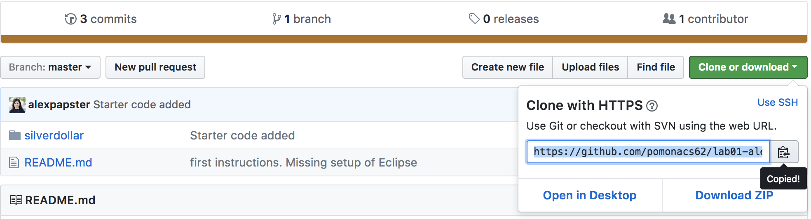

# Submission instructions

This document summarizes the steps you need to follow to successfully submit your lab and assignment work. We assume you have already configured Eclipse and your workspace correctly. If not, look into `lab01`.

# Cloning the Repository in Eclipse

* We will provide you with a URL that contains an invitation for joining the lab/assignment. Copy the URL on your browser. You should see a similar message:

* Once you accept the invitation, you will be provided with a unique URL that matches you only. Click  it. 

* You will see the unique copy of your lab repository:

* Click on the green `Clone or download` button and copy the given HTTPS URL:

* Launch Eclipse. As a first step, we will clone the lab repository. Go to `Navigate>Show In>Git Repositories`. For the first time, your Git View will be empty.

* Click on `Clone a Git repository` link or button to see the following window appear

* Paste the URL you copied from Github. It will automatically populate the fields. Add your Github username and password. Make sure to check `Store in Secure Store` unless you want to re-enter your credentials every time you interact with the repository. Feel free to add a password hint if you consider it necessary, once prompted.

* Follow the Wizard by clicking `Next`. Make sure you choose your Eclipse workspace as the destination before clickinging `Finish`. You will now see the repository appearing in your Git repositories.

5. **Create a New Java Project**: 

* To start a project, select `File>New>Java Project`. Give your project a
name, like `Lab01`, but **do not click `Finish` yet**!

* Check if the `Use Default Location` points to the repository in your workspace (e.g., `/home/apapoutsaki/Documents/cs062/workspace/lab01-alexpapster`.

* If you need to use the `bailey` library, click `Next`, then `Libraries`, and then `Add Variable`.
Add the variable `BAILEY`, and then click `OK` and `Finish`.

* You will now see the code we provided you and you need to start working on in the `Package Explorer`

## Submitting your work

* Every time you feel that you have completed a substantial or logical part of your program, you should consider committing and pushing your work. This will also allow us to monitor your progress. **AVOID** one big push at the end of your work. This will make us suspicious about your work. For example, after editing the `toString` method you might want to commit your work. 

Right click on the repository and then click `Commit`.

* Transfer all your files from `Unstaged Changes` to `Staged Changes`. 

* Write a meaningful message. For example, since I edited the header I wrote the following:

* Click `Commit and Push`

* Want to confirm that we can see your work? Go to the URL that you were given. You can see the latest commit you pushed.

* Make sure you edit the `.json` file you are given with every lab/assignment to include your username, your partner's username (if collaboration is allowed), and indicate if you did any extra credit work.

* Submitting correctly is your responsibility, and if you forget to submit or submit unsuccessfully without
following up, everyone will be unhappy. Make sure you commit and push regularly so that we can see your progress and you avoid losing your work. 

**Important:** The last commit you push by the due date is the one we will look at and grade.
